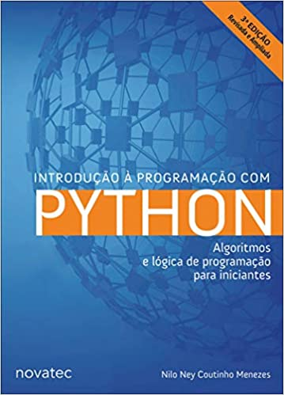

# IntroducaoAoPython
 
 Este repositório contém os exercicios resolvidos do livro(descrição abaixo) feitos por Jocelino F.GARCIA.  Lembrando que os exercicios podem ser feitos de vários jeitos e formas eu apenas estou compartilhando com a comunidade a maneira que encontrei para resolvê-los.
 

Livro: Introdução a programação em Python: Algoritmos e lógica de programação para iniciantes

- Autor: Nilo Ney Coutinho Menezes

- Edição: 3ª edição, Revisada e Ampliada

- Editora: Novatec

- Ano: 2019

- Foto: 

